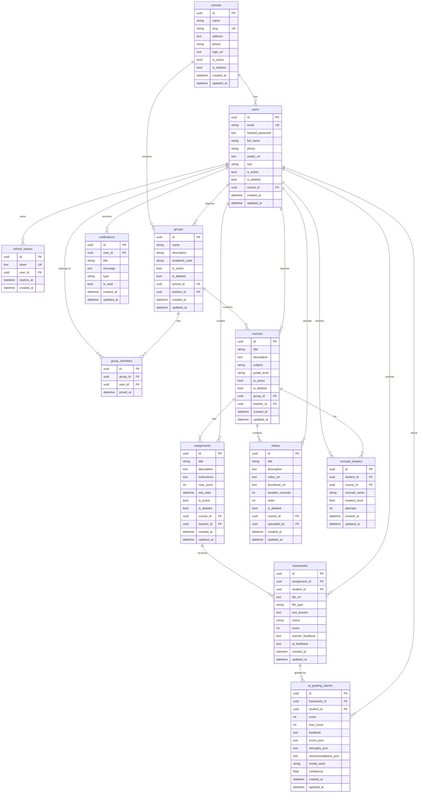

# ERD — Entity Relationship Diagram

Ma'lumotlar bazasi jadvallari va ular orasidagi bog'lanishlar.

## Diagramma

## Jadvallar haqida qisqacha

| Jadval | Tavsif | Asosiy bog'lanish |
|---|---|---|
| `schools` | Maktab/tashkilot (multi-tenant) | → users, groups |
| `users` | Foydalanuvchilar (admin/teacher/student) | → school, groups, homeworks |
| `refresh_tokens` | JWT refresh tokenlar | → users |
| `groups` | Guruhlar/sinflar | → school, teacher, members |
| `group_members` | Guruh a'zolari (M:N) | → group, user |
| `courses` | Kurslar/fanlar | → group, teacher |
| `assignments` | Vazifalar/topshiriqlar | → course, teacher |
| `homeworks` | O'quvchi javoblari | → assignment, student |
| `videos` | Video darslar | → course, uploader |
| `ai_grading_reports` | AI baholash natijalari | → homework, student |
| `concept_mastery` | Tushuncha darajasi | → student, course |
| `notifications` | Xabarnomalar | → user |
